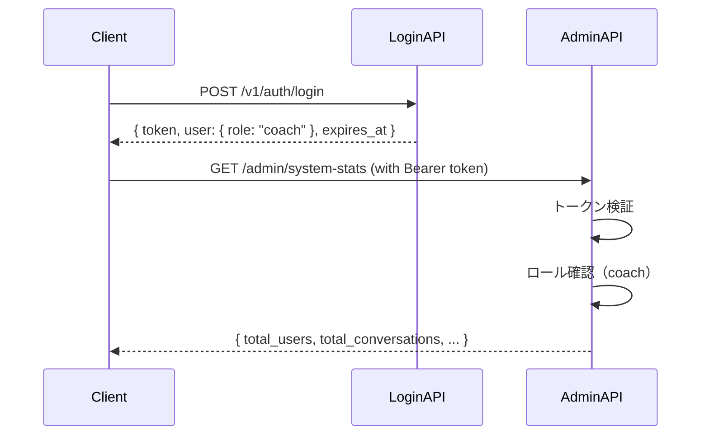

# AdminDashboardPage（D-004）API仕様書

作成日: 2025-11-02
対象ページ: /admin/dashboard
バージョン: MVP v1.0

## 概要

本ドキュメントは、AdminDashboardPage（管理ダッシュボード）で使用されるAPIエンドポイントの仕様を定義します。現在はモックサービス（`mockAdminService.ts`）で実装されており、本番環境ではDify APIおよびCOM:PASS APIに置き換えられます。

## エンドポイント一覧

| No | メソッド | エンドポイント | 用途 | モック関数 | 優先度 |
|----|---------|--------------|------|-----------|--------|
| 1 | GET | `/admin/system-stats` | システム統計取得 | `mockGetSystemStats` | 高 |

---

## API詳細仕様

---

### 1. システム統計取得 API

#### 基本情報
- **エンドポイント**: `GET /admin/system-stats`
- **認証**: 必須（Bearer Token、コーチロールのみ）
- **用途**: 管理ダッシュボードのシステム統計情報を取得

#### Request

##### Headers
```http
Authorization: Bearer {token}
```

##### Query Parameters
なし

##### Request Example
```http
GET /admin/system-stats
```

#### Response

##### Success Response (200 OK)
```json
{
  "total_users": 28,
  "total_conversations": 156,
  "total_messages": 1247,
  "api_usage": {
    "claude_tokens": 45230,
    "openai_tokens": 12890
  },
  "uptime": 2592000
}
```

##### Response Fields
| フィールド | 型 | 説明 | 例 |
|----------|---|------|-----|
| `total_users` | number | 総ユーザー数（クライアント + コーチ） | `28` |
| `total_conversations` | number | 総会話数（全ユーザーの合計） | `156` |
| `total_messages` | number | 総メッセージ数（ユーザー + AI応答） | `1247` |
| `api_usage` | object | API使用状況 | `{...}` |
| `api_usage.claude_tokens` | number | Claude APIの総トークン使用量 | `45230` |
| `api_usage.openai_tokens` | number | OpenAI APIの総トークン使用量 | `12890` |
| `uptime` | number | システム稼働時間（秒） | `2592000` (30日分) |

##### Response Fields Details

**total_users**
- クライアントとコーチの合計人数
- 有効なアカウントのみカウント（削除済みは除外）
- 表示形式: `{total_users}人`

**total_conversations**
- 全ユーザーの会話セッション総数
- 空の会話（メッセージ0件）も含む
- 表示形式: `{total_conversations}件`

**total_messages**
- ユーザーメッセージ + AI応答メッセージの総数
- 削除された会話のメッセージは除外
- 表示形式: `{total_messages.toLocaleString()}件` (カンマ区切り)

**api_usage**
- Claude APIとOpenAI APIの合計トークン使用量
- 過去30日間の累計（本番実装時はリセット可能）
- 表示形式: `{Math.floor((claude_tokens + openai_tokens) / 1000)}Kトークン`

**uptime**
- システムが起動してからの経過時間（秒単位）
- 再起動後はリセットされる
- 表示形式（フロントエンド側で変換）:
  - 60秒未満: `{uptime}秒`
  - 60秒以上3600秒未満: `{Math.floor(uptime / 60)}分`
  - 3600秒以上86400秒未満: `{Math.floor(uptime / 3600)}時間`
  - 86400秒以上: `{Math.floor(uptime / 86400)}日`

##### Error Response (401 Unauthorized)
```json
{
  "error": "unauthorized",
  "message": "認証が必要です",
  "status": 401
}
```

##### Error Response (403 Forbidden)
```json
{
  "error": "forbidden",
  "message": "コーチロールのみアクセス可能です",
  "status": 403
}
```

##### Error Response (500 Internal Server Error)
```json
{
  "error": "internal_server_error",
  "message": "システム統計の取得に失敗しました",
  "status": 500
}
```

#### モック実装の挙動

##### 初期データ
モックサービスは固定の統計データを返します。

```typescript
const MOCK_SYSTEM_STATS: SystemStats = {
  total_users: 28,
  total_conversations: 156,
  total_messages: 1247,
  api_usage: {
    claude_tokens: 45230,
    openai_tokens: 12890,
  },
  uptime: 2592000, // 30日分の秒数
};
```

##### 応答遅延
```typescript
await new Promise((resolve) => setTimeout(resolve, 500)); // 500ms遅延
```

#### エラーハンドリング

##### クライアント側
```typescript
const [stats, setStats] = useState<SystemStats | null>(null);
const [loading, setLoading] = useState(true);
const [error, setError] = useState<string | null>(null);

useEffect(() => {
  const fetchStats = async () => {
    try {
      setLoading(true);
      setError(null);
      const data = await mockGetSystemStats();
      setStats(data);
    } catch (err) {
      setError('システム統計の取得に失敗しました');
      console.error('Failed to fetch system stats:', err);
    } finally {
      setLoading(false);
    }
  };

  fetchStats();
}, []);
```

#### セキュリティ

##### アクセス制御
- **認証**: Bearerトークン必須
- **認可**: コーチロール（`role: "coach"`）のみアクセス可能
- **クライアントロール**: 403 Forbiddenエラーを返す
- **未認証ユーザー**: 401 Unauthorizedエラーを返す

##### 実装例（バックエンド側）
```python
@app.route('/admin/system-stats', methods=['GET'])
@require_auth
@require_role('coach')
def get_system_stats():
    """
    システム統計取得エンドポイント
    コーチロールのみアクセス可能
    """
    try:
        stats = {
            "total_users": count_total_users(),
            "total_conversations": count_total_conversations(),
            "total_messages": count_total_messages(),
            "api_usage": {
                "claude_tokens": get_claude_token_usage(),
                "openai_tokens": get_openai_token_usage(),
            },
            "uptime": get_system_uptime(),
        }
        return jsonify(stats), 200
    except Exception as e:
        logger.error(f"Failed to fetch system stats: {e}")
        return jsonify({
            "error": "internal_server_error",
            "message": "システム統計の取得に失敗しました",
            "status": 500
        }), 500
```

#### パフォーマンス

##### 応答時間目標
- **通常時**: 500ms以内
- **高負荷時**: 1秒以内

##### キャッシング戦略
- **キャッシュTTL**: 5分
- **キャッシュキー**: `system-stats`
- **理由**: 統計データは頻繁に変動しないため、キャッシュ可能

##### 実装例（Redis キャッシング）
```python
import redis
import json
from datetime import timedelta

redis_client = redis.Redis(host='localhost', port=6379, db=0)
CACHE_KEY = "system-stats"
CACHE_TTL = timedelta(minutes=5)

@app.route('/admin/system-stats', methods=['GET'])
@require_auth
@require_role('coach')
def get_system_stats():
    # キャッシュチェック
    cached_stats = redis_client.get(CACHE_KEY)
    if cached_stats:
        return jsonify(json.loads(cached_stats)), 200

    # キャッシュミス時はDBから取得
    stats = {
        "total_users": count_total_users(),
        "total_conversations": count_total_conversations(),
        "total_messages": count_total_messages(),
        "api_usage": {
            "claude_tokens": get_claude_token_usage(),
            "openai_tokens": get_openai_token_usage(),
        },
        "uptime": get_system_uptime(),
    }

    # キャッシュに保存
    redis_client.setex(CACHE_KEY, CACHE_TTL, json.dumps(stats))

    return jsonify(stats), 200
```

---

## データ型定義

### TypeScript型定義（frontend/src/types/index.ts）

```typescript
// システム統計
export interface SystemStats {
  total_users: number;
  total_conversations: number;
  total_messages: number;
  api_usage: {
    claude_tokens: number;
    openai_tokens: number;
  };
  uptime: number; // 秒
}

// APIエラーレスポンス
export interface ApiError {
  error: string;
  message: string;
  status: number;
}

// API エンドポイント定義
export const API_PATHS = {
  // ...
  ADMIN: {
    SYSTEM_STATS: '/admin/system-stats',
  },
  // ...
} as const;
```

---

## 認証

### 認証方式
- **方式**: Bearer Token認証
- **ヘッダー**: `Authorization: Bearer {token}`
- **トークン取得**: ログインAPI（`POST /v1/auth/login`）で取得
- **トークン有効期限**: 24時間
- **ロール確認**: トークンに含まれる`role`クレームで判定

### 認証フロー


### エラーハンドリング
```typescript
// 401 Unauthorized: トークン期限切れ
if (error.status === 401) {
  // ログインページにリダイレクト
  window.location.href = '/login';
}

// 403 Forbidden: コーチロールではない
if (error.status === 403) {
  // クライアント向けチャットページにリダイレクト
  window.location.href = '/chat';
}
```

---

## レート制限

### 制限値（MVP段階）
- **システム統計取得**: 30リクエスト/分/ユーザー

### レート制限超過時のレスポンス
```json
{
  "error": "rate_limit_exceeded",
  "message": "リクエスト数が制限を超えました。1分後に再試行してください。",
  "status": 429,
  "retry_after": 60
}
```

---

## モックから本番APIへの移行

### @MOCK_TO_API マーカー

モックサービス内に以下のマーカーが記載されています。

#### mockGetSystemStats
```typescript
// @MOCK_TO_API: GET {API_PATHS.ADMIN.SYSTEM_STATS}
// Response: SystemStats
```

### 移行手順

#### 1. 本番サービス実装
```typescript
// frontend/src/services/api/adminService.ts
import axios from 'axios';
import { API_PATHS } from '@/types';
import type { SystemStats } from '@/types';

const api = axios.create({
  baseURL: process.env.NEXT_PUBLIC_API_BASE_URL,
  headers: {
    'Content-Type': 'application/json',
  },
});

// リクエストインターセプター（認証トークン付与）
api.interceptors.request.use((config) => {
  const token = localStorage.getItem('auth_token');
  if (token) {
    config.headers.Authorization = `Bearer ${token}`;
  }
  return config;
});

// レスポンスインターセプター（エラーハンドリング）
api.interceptors.response.use(
  (response) => response,
  (error) => {
    if (error.response?.status === 401) {
      // 認証エラー時はログインページにリダイレクト
      window.location.href = '/login';
    } else if (error.response?.status === 403) {
      // 権限エラー時はクライアント向けページにリダイレクト
      window.location.href = '/chat';
    }
    return Promise.reject(error);
  }
);

/**
 * システム統計取得
 * @returns システム統計情報
 */
export const getSystemStats = async (): Promise<SystemStats> => {
  const response = await api.get(API_PATHS.ADMIN.SYSTEM_STATS);
  return response.data;
};
```

#### 2. AdminDashboardPage内のimport変更
```typescript
// Before (モック)
import { mockGetSystemStats } from '@/services/api/mockAdminService';

// After (本番)
import { getSystemStats } from '@/services/api/adminService';
```

#### 3. 関数名の置換
```typescript
// Before
const data = await mockGetSystemStats();

// After
const data = await getSystemStats();
```

---

## データ取得の詳細仕様

### バックエンド実装の考慮事項

#### 1. total_users の算出
```sql
-- PostgreSQL例
SELECT COUNT(*) FROM users WHERE deleted_at IS NULL;
```

#### 2. total_conversations の算出
```sql
-- PostgreSQL例
SELECT COUNT(*) FROM conversations WHERE deleted_at IS NULL;
```

#### 3. total_messages の算出
```sql
-- PostgreSQL例
SELECT COUNT(*) FROM messages
WHERE conversation_id IN (
  SELECT id FROM conversations WHERE deleted_at IS NULL
);
```

#### 4. api_usage の算出
```sql
-- PostgreSQL例
SELECT
  SUM(CASE WHEN provider = 'claude' THEN tokens_used ELSE 0 END) AS claude_tokens,
  SUM(CASE WHEN provider = 'openai' THEN tokens_used ELSE 0 END) AS openai_tokens
FROM api_usage_logs
WHERE created_at >= NOW() - INTERVAL '30 days';
```

#### 5. uptime の算出
```python
import time

# サーバー起動時刻を保存
SERVER_START_TIME = time.time()

def get_system_uptime() -> int:
    """システム稼働時間（秒）を返す"""
    return int(time.time() - SERVER_START_TIME)
```

---

## セキュリティ

### データアクセス制御
- **コーチロールのみアクセス可能**: トークンの`role`クレームで判定
- **クライアントロール**: 403 Forbiddenエラー
- **未認証**: 401 Unauthorizedエラー

### 機密情報の取り扱い
- **統計データ**: コーチのみ閲覧可能
- **個人情報は含まない**: ユーザー名、メールアドレス等は非表示
- **集計データのみ**: 個別ユーザーのデータは含まない

### SQL インジェクション対策
- **ORMのパラメータ化クエリ使用**: SQLAlchemy、Django ORM等
- **Raw SQLは使用しない**: 必要な場合はプレースホルダー使用

---

## パフォーマンス最適化

### データベースクエリ最適化
- **インデックス設定**: `users.deleted_at`, `conversations.deleted_at`, `messages.conversation_id`
- **集計クエリの最適化**: `COUNT(*)`の高速化
- **定期的なVACUUM**: PostgreSQLの統計情報更新

### キャッシング戦略
- **キャッシュTTL**: 5分
- **キャッシュ無効化**: 新規ユーザー登録、会話作成時にキャッシュクリア
- **キャッシュキー**: `system-stats`

### 応答時間目標
- **初回アクセス**: 500ms以内（DBクエリ実行）
- **キャッシュヒット**: 100ms以内

---

## 本番環境での拡張機能（MVP後）

### 1. 日時範囲指定
```http
GET /admin/system-stats?start_date=2025-11-01&end_date=2025-11-30
```

### 2. 詳細統計（ユーザー別、日別）
```http
GET /admin/detailed-stats?group_by=user&start_date=2025-11-01
```

### 3. リアルタイム統計（WebSocket）
```javascript
const ws = new WebSocket('wss://api.example.com/admin/stats-stream');
ws.onmessage = (event) => {
  const stats = JSON.parse(event.data);
  setStats(stats);
};
```

---

## 参考リンク

- [要件定義書](../requirements.md) - D-004仕様
- [E2Eテスト仕様書](../e2e-specs/admin-dashboard-e2e.md)
- [AdminDashboardPage実装](../../frontend/src/pages/AdminDashboardPage/index.tsx)
- [モックサービス](../../frontend/src/services/api/mockAdminService.ts)
- [型定義](../../frontend/src/types/index.ts)
- [プロジェクト設定 (CLAUDE.md)](../../CLAUDE.md)

---

**作成日**: 2025-11-02
**バージョン**: MVP v1.0
**次回更新予定**: Dify API統合時
