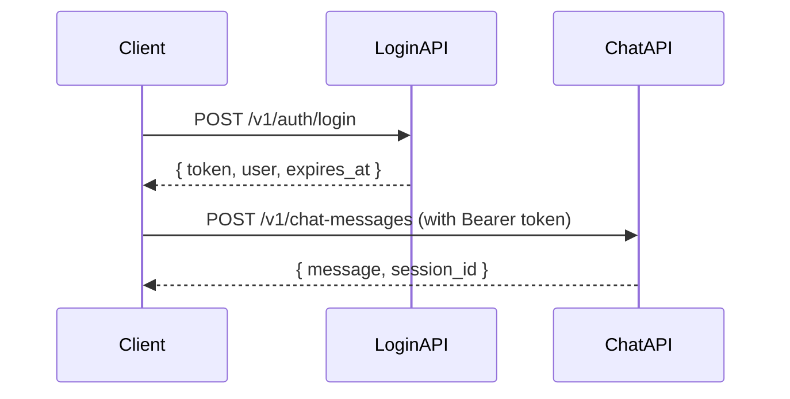

# ChatPage（D-002）API仕様書

作成日: 2025-11-02
対象ページ: /chat
バージョン: MVP v1.0

## 概要

本ドキュメントは、ChatPage（AIチャットページ）で使用されるAPIエンドポイントの仕様を定義します。現在はモックサービス（`mockChatService.ts`）で実装されており、本番環境ではDify APIに置き換えられます。

## エンドポイント一覧

| No | メソッド | エンドポイント | 用途 | モック関数 | 優先度 |
|----|---------|--------------|------|-----------|--------|
| 1 | POST | `/v1/chat-messages` | メッセージ送信 | `mockSendMessage` | 高 |
| 2 | GET | `/v1/conversations` | 会話一覧取得 | `mockGetConversations` | 高 |
| 3 | GET | `/v1/conversations/{sessionId}/messages` | 会話詳細取得 | `mockGetMessages` | 高 |
| 4 | POST | `/v1/conversations` | 新規会話作成 | `mockCreateConversation` | 中 |
| 5 | DELETE | `/v1/conversations/{sessionId}` | 会話削除 | `mockDeleteConversation` | 低 |

---

## API詳細仕様

---

### 1. メッセージ送信 API

#### 基本情報
- **エンドポイント**: `POST /v1/chat-messages`
- **認証**: 必須（Bearer Token）
- **用途**: ユーザーメッセージを送信し、AI応答を取得

#### Request

##### Headers
```http
Content-Type: application/json
Authorization: Bearer {token}
```

##### Body Parameters
| パラメータ | 型 | 必須 | 説明 | 例 |
|----------|---|-----|------|-----|
| `session_id` | string | × | セッションID（新規会話の場合は省略） | `"session-001"` |
| `content` | string | ○ | メッセージ内容 | `"今週の目標について相談したいです"` |

##### Request Example
```json
{
  "session_id": "session-001",
  "content": "今週の目標について相談したいです"
}
```

##### 新規会話の場合（session_id省略）
```json
{
  "content": "今週の目標について相談したいです"
}
```

#### Response

##### Success Response (200 OK)
```json
{
  "message": {
    "message_id": "msg-1730515200000-assistant",
    "session_id": "session-001",
    "role": "assistant",
    "content": "ご相談ありがとうございます。目標設定は、あなたの成長において非常に重要なステップですね。\n\nSMART原則（Specific, Measurable, Achievable, Relevant, Time-bound）に基づいて目標を設定することで、より明確で達成可能な目標になります。\n\n具体的に、今週はどのような目標を立てたいとお考えですか？",
    "citations": [
      {
        "source": "コーチング理論体系.pdf",
        "content": "SMART原則は、効果的な目標設定のフレームワークとして広く活用されています。",
        "dataset_type": "system"
      },
      {
        "source": "あなたの過去の目標設定記録",
        "content": "先月は3つの目標を設定し、2つを達成されています。",
        "dataset_type": "user"
      }
    ],
    "created_at": "2025-11-02T15:30:25.000Z",
    "tokens_used": 245
  },
  "session_id": "session-001"
}
```

##### Response Fields
| フィールド | 型 | 説明 | 例 |
|----------|---|------|-----|
| `message.message_id` | string | メッセージID（UUID） | `"msg-1730515200000-assistant"` |
| `message.session_id` | string | セッションID（UUID） | `"session-001"` |
| `message.role` | string | メッセージ送信者（`"user"` or `"assistant"`） | `"assistant"` |
| `message.content` | string | メッセージ内容 | `"ご相談ありがとうございます..."` |
| `message.citations` | array | 引用元情報（省略可） | `[{...}]` |
| `message.citations[].source` | string | 引用元ドキュメント名 | `"コーチング理論体系.pdf"` |
| `message.citations[].content` | string | 引用テキスト | `"SMART原則は..."` |
| `message.citations[].dataset_type` | string | データセット種別（`"system"` or `"user"`） | `"system"` |
| `message.created_at` | string | メッセージ作成日時（ISO 8601） | `"2025-11-02T15:30:25.000Z"` |
| `message.tokens_used` | number | 使用トークン数（省略可） | `245` |
| `session_id` | string | セッションID（新規会話の場合は新規生成されたID） | `"session-001"` |

##### Error Response (400 Bad Request)
```json
{
  "error": "validation_error",
  "message": "メッセージ内容が空です",
  "status": 400
}
```

##### Error Response (401 Unauthorized)
```json
{
  "error": "unauthorized",
  "message": "認証が必要です",
  "status": 401
}
```

##### Error Response (500 Internal Server Error)
```json
{
  "error": "internal_server_error",
  "message": "AI応答の生成に失敗しました",
  "status": 500
}
```

#### モック実装の挙動

##### 応答パターン
モックサービスは、メッセージ内容のキーワードに基づいてAI応答パターンを選択します。

| キーワード | 応答パターン | 引用元数 |
|----------|------------|---------|
| `目標` | SMART原則に基づく目標設定サポート | 2件（システム + ユーザー） |
| `振り返り` | リフレクション技法に基づく振り返りサポート | 1件（システム） |
| `モチベーション` | モチベーション理論に基づくサポート | 2件（システム + ユーザー） |
| `キャリア` | キャリア開発ガイドに基づくサポート | 1件（システム） |
| その他 | デフォルト応答 | 0件 |

##### 応答遅延
```typescript
const delay = Math.random() * 2000 + 3000; // 3-5秒のランダム遅延
```

#### エラーハンドリング

##### クライアント側
```typescript
try {
  const response = await mockSendMessage({
    session_id: currentSessionId || undefined,
    content: messageContent,
  });

  // 正常処理
  setMessages((prev) => [...prev, response.message]);
} catch (error) {
  console.error('メッセージ送信エラー:', error);

  // エラーメッセージ表示
  const errorMessage: Message = {
    message_id: `error-${Date.now()}`,
    session_id: currentSessionId || '',
    role: 'assistant',
    content: '申し訳ございません。エラーが発生しました。もう一度お試しください。',
    created_at: new Date().toISOString(),
  };
  setMessages((prev) => [...prev, errorMessage]);
}
```

---

### 2. 会話一覧取得 API

#### 基本情報
- **エンドポイント**: `GET /v1/conversations`
- **認証**: 必須（Bearer Token）
- **用途**: ユーザーの会話履歴一覧を取得

#### Request

##### Headers
```http
Authorization: Bearer {token}
```

##### Query Parameters
| パラメータ | 型 | 必須 | 説明 | 例 |
|----------|---|-----|------|-----|
| `user_id` | string | ○ | ユーザーID | `"client-001"` |

##### Request Example
```http
GET /v1/conversations?user_id=client-001
```

#### Response

##### Success Response (200 OK)
```json
[
  {
    "session_id": "session-001",
    "user_id": "client-001",
    "title": "今週の目標について",
    "created_at": "2025-11-02T10:00:00.000Z",
    "updated_at": "2025-11-02T15:30:25.000Z",
    "message_count": 8
  },
  {
    "session_id": "session-002",
    "user_id": "client-001",
    "title": "キャリアの方向性",
    "created_at": "2025-11-01T14:20:00.000Z",
    "updated_at": "2025-11-01T16:45:30.000Z",
    "message_count": 5
  }
]
```

##### Response Fields
| フィールド | 型 | 説明 | 例 |
|----------|---|------|-----|
| `session_id` | string | セッションID（UUID） | `"session-001"` |
| `user_id` | string | ユーザーID | `"client-001"` |
| `title` | string | 会話タイトル（省略可） | `"今週の目標について"` |
| `created_at` | string | 会話作成日時（ISO 8601） | `"2025-11-02T10:00:00.000Z"` |
| `updated_at` | string | 最終更新日時（ISO 8601、省略可） | `"2025-11-02T15:30:25.000Z"` |
| `message_count` | number | メッセージ数（省略可） | `8` |

##### Error Response (401 Unauthorized)
```json
{
  "error": "unauthorized",
  "message": "認証が必要です",
  "status": 401
}
```

##### Error Response (500 Internal Server Error)
```json
{
  "error": "internal_server_error",
  "message": "会話一覧の取得に失敗しました",
  "status": 500
}
```

#### モック実装の挙動

##### 初期データ
モックサービスは4件の会話履歴を返します。

```typescript
const MOCK_CONVERSATIONS: Conversation[] = [
  {
    session_id: 'session-001',
    user_id: 'client-001',
    title: '今週の目標について',
    created_at: new Date().toISOString(),
    updated_at: new Date().toISOString(),
    message_count: 8,
  },
  // ... 他3件
];
```

##### 応答遅延
```typescript
await new Promise((resolve) => setTimeout(resolve, 500)); // 500ms遅延
```

#### エラーハンドリング

##### クライアント側
```typescript
try {
  const convs = await mockGetConversations(user.user_id);
  setConversations(convs);
} catch (error) {
  console.error('会話履歴の取得に失敗:', error);
  // エラー表示はせず、空の会話履歴として扱う
}
```

---

### 3. 会話詳細取得 API

#### 基本情報
- **エンドポイント**: `GET /v1/conversations/{sessionId}/messages`
- **認証**: 必須（Bearer Token）
- **用途**: 特定の会話のメッセージ一覧を取得

#### Request

##### Headers
```http
Authorization: Bearer {token}
```

##### Path Parameters
| パラメータ | 型 | 必須 | 説明 | 例 |
|----------|---|-----|------|-----|
| `sessionId` | string | ○ | セッションID | `"session-001"` |

##### Request Example
```http
GET /v1/conversations/session-001/messages
```

#### Response

##### Success Response (200 OK)
```json
[
  {
    "message_id": "msg-001",
    "session_id": "session-001",
    "role": "user",
    "content": "今週の目標について相談したいです。",
    "created_at": "2025-11-02T14:30:00.000Z"
  },
  {
    "message_id": "msg-002",
    "session_id": "session-001",
    "role": "assistant",
    "content": "ご相談ありがとうございます。目標設定は、あなたの成長において非常に重要なステップですね。...",
    "citations": [
      {
        "source": "コーチング理論体系.pdf",
        "content": "SMART原則は、効果的な目標設定のフレームワークとして広く活用されています。",
        "dataset_type": "system"
      }
    ],
    "created_at": "2025-11-02T14:30:05.000Z",
    "tokens_used": 245
  }
]
```

##### Response Fields
配列の各要素は、メッセージ送信APIの`message`フィールドと同じ構造です。

##### Error Response (401 Unauthorized)
```json
{
  "error": "unauthorized",
  "message": "認証が必要です",
  "status": 401
}
```

##### Error Response (404 Not Found)
```json
{
  "error": "not_found",
  "message": "指定されたセッションが見つかりません",
  "status": 404
}
```

##### Error Response (500 Internal Server Error)
```json
{
  "error": "internal_server_error",
  "message": "メッセージ一覧の取得に失敗しました",
  "status": 500
}
```

#### モック実装の挙動

##### メッセージストア
モックサービスは、セッションIDをキーとしたメッセージストアを使用します。

```typescript
const MESSAGE_STORE: Record<string, Message[]> = {
  'session-001': [
    {
      message_id: 'msg-001',
      session_id: 'session-001',
      role: 'user',
      content: '今週の目標について相談したいです。',
      created_at: new Date(Date.now() - 3600000).toISOString(),
    },
    // ... AI応答
  ],
};
```

##### 応答遅延
```typescript
await new Promise((resolve) => setTimeout(resolve, 500)); // 500ms遅延
```

#### エラーハンドリング

##### クライアント側
```typescript
try {
  const msgs = await mockGetMessages(sessionId);
  setMessages(msgs);
  setCurrentSessionId(sessionId);
  setSidebarOpen(false);
} catch (error) {
  console.error('会話読み込みエラー:', error);
  // エラー表示はせず、会話履歴ドロワーを開いたままにする
}
```

---

### 4. 新規会話作成 API

#### 基本情報
- **エンドポイント**: `POST /v1/conversations`
- **認証**: 必須（Bearer Token）
- **用途**: 新しい会話セッションを作成

#### Request

##### Headers
```http
Content-Type: application/json
Authorization: Bearer {token}
```

##### Body Parameters
| パラメータ | 型 | 必須 | 説明 | 例 |
|----------|---|-----|------|-----|
| `user_id` | string | ○ | ユーザーID | `"client-001"` |

##### Request Example
```json
{
  "user_id": "client-001"
}
```

#### Response

##### Success Response (201 Created)
```json
{
  "session_id": "session-1730515200000",
  "user_id": "client-001",
  "title": "新しい会話",
  "created_at": "2025-11-02T15:40:00.000Z",
  "updated_at": "2025-11-02T15:40:00.000Z",
  "message_count": 0
}
```

##### Response Fields
会話一覧取得APIの各要素と同じ構造です。

##### Error Response (400 Bad Request)
```json
{
  "error": "validation_error",
  "message": "ユーザーIDが無効です",
  "status": 400
}
```

##### Error Response (401 Unauthorized)
```json
{
  "error": "unauthorized",
  "message": "認証が必要です",
  "status": 401
}
```

##### Error Response (500 Internal Server Error)
```json
{
  "error": "internal_server_error",
  "message": "会話の作成に失敗しました",
  "status": 500
}
```

#### モック実装の挙動

##### 新規会話の生成
```typescript
const newConversation: Conversation = {
  session_id: `session-${Date.now()}`,
  user_id: userId,
  title: '新しい会話',
  created_at: new Date().toISOString(),
  updated_at: new Date().toISOString(),
  message_count: 0,
};

MOCK_CONVERSATIONS.unshift(newConversation);
```

##### 応答遅延
```typescript
await new Promise((resolve) => setTimeout(resolve, 300)); // 300ms遅延
```

#### エラーハンドリング

##### クライアント側
```typescript
try {
  const newConv = await mockCreateConversation(user.user_id);
  setCurrentSessionId(newConv.session_id);
  setMessages([]);
  await loadConversations();
} catch (error) {
  console.error('新規会話作成エラー:', error);
  // エラー通知を表示（実装時にトースト等を追加）
}
```

---

### 5. 会話削除 API

#### 基本情報
- **エンドポイント**: `DELETE /v1/conversations/{sessionId}`
- **認証**: 必須（Bearer Token）
- **用途**: 会話を削除（MVP段階では未使用）

#### Request

##### Headers
```http
Authorization: Bearer {token}
```

##### Path Parameters
| パラメータ | 型 | 必須 | 説明 | 例 |
|----------|---|-----|------|-----|
| `sessionId` | string | ○ | セッションID | `"session-001"` |

##### Request Example
```http
DELETE /v1/conversations/session-001
```

#### Response

##### Success Response (204 No Content)
レスポンスボディなし

##### Error Response (401 Unauthorized)
```json
{
  "error": "unauthorized",
  "message": "認証が必要です",
  "status": 401
}
```

##### Error Response (404 Not Found)
```json
{
  "error": "not_found",
  "message": "指定されたセッションが見つかりません",
  "status": 404
}
```

##### Error Response (500 Internal Server Error)
```json
{
  "error": "internal_server_error",
  "message": "会話の削除に失敗しました",
  "status": 500
}
```

#### モック実装の挙動

##### 会話削除処理
```typescript
const index = MOCK_CONVERSATIONS.findIndex((conv) => conv.session_id === sessionId);
if (index !== -1) {
  MOCK_CONVERSATIONS.splice(index, 1);
}

// メッセージストアからも削除
delete MESSAGE_STORE[sessionId];
```

##### 応答遅延
```typescript
await new Promise((resolve) => setTimeout(resolve, 300)); // 300ms遅延
```

#### 注意事項
- **MVP段階では未使用**: ChatPageには削除機能のUIが未実装
- **本番化時に実装**: ユーザー向けに会話削除機能を追加予定

---

## データ型定義

### TypeScript型定義（frontend/src/types/index.ts）

```typescript
// ユーザーロール
export type UserRole = 'client' | 'coach';

// メッセージロール
export type MessageRole = 'user' | 'assistant';

// データセット種別
export type DatasetType = 'system' | 'user';

// AIモード
export type AIMode = 'problem-solving' | 'learning-support' | 'planning' | 'companionship';

// 会話
export interface Conversation {
  session_id: string; // UUID
  user_id: string;
  title?: string;
  created_at: string; // ISO 8601
  updated_at?: string; // ISO 8601
  message_count?: number;
}

// 引用元
export interface Citation {
  source: string; // ドキュメント名
  content: string; // 引用テキスト
  dataset_type: DatasetType; // 'system' | 'user'
}

// メッセージ
export interface Message {
  message_id: string; // UUID
  session_id: string;
  role: MessageRole;
  content: string;
  citations?: Citation[]; // 引用元情報
  created_at: string; // ISO 8601
  tokens_used?: number;
}

// チャットメッセージ送信リクエスト
export interface ChatMessageRequest {
  session_id?: string; // 新規会話の場合は省略
  content: string;
}

// チャットメッセージレスポンス
export interface ChatMessageResponse {
  message: Message;
  session_id: string;
}

// APIエラーレスポンス
export interface ApiError {
  error: string;
  message: string;
  status: number;
}
```

---

## 認証

### 認証方式
- **方式**: Bearer Token認証
- **ヘッダー**: `Authorization: Bearer {token}`
- **トークン取得**: ログインAPI（`POST /v1/auth/login`）で取得
- **トークン有効期限**: 24時間

### 認証フロー


### エラーハンドリング
```typescript
// 401 Unauthorized: トークン期限切れ
if (error.status === 401) {
  // ログインページにリダイレクト
  window.location.href = '/login';
}
```

---

## レート制限

### 制限値（MVP段階）
- **メッセージ送信**: 10リクエスト/分/ユーザー
- **会話一覧取得**: 30リクエスト/分/ユーザー
- **会話詳細取得**: 60リクエスト/分/ユーザー

### レート制限超過時のレスポンス
```json
{
  "error": "rate_limit_exceeded",
  "message": "リクエスト数が制限を超えました。1分後に再試行してください。",
  "status": 429,
  "retry_after": 60
}
```

---

## モックから本番APIへの移行

### @MOCK_TO_API マーカー

モックサービス内に以下のマーカーが記載されています。

#### mockSendMessage
```typescript
// @MOCK_TO_API: POST {API_PATHS.CHAT.MESSAGES}
// Request: ChatMessageRequest
// Response: ChatMessageResponse
```

#### mockGetConversations
```typescript
// @MOCK_TO_API: GET {API_PATHS.CHAT.CONVERSATIONS}?user_id={userId}
// Response: Conversation[]
```

#### mockGetMessages
```typescript
// @MOCK_TO_API: GET {API_PATHS.CHAT.CONVERSATION_DETAIL(sessionId)}/messages
// Response: Message[]
```

#### mockCreateConversation
```typescript
// @MOCK_TO_API: POST {API_PATHS.CHAT.CONVERSATIONS}
// Request: { user_id: string }
// Response: Conversation
```

#### mockDeleteConversation
```typescript
// @MOCK_TO_API: DELETE {API_PATHS.CHAT.DELETE_CONVERSATION(sessionId)}
// Response: void
```

### 移行手順

#### 1. Dify API設定
```env
# dify/docker/.env
DIFY_API_BASE_URL=http://localhost:5001
DIFY_API_KEY={生成されたAPIキー}
```

#### 2. 本番サービス実装
```typescript
// frontend/src/services/api/chatService.ts
import axios from 'axios';
import { API_PATHS } from '@/types';
import type { ChatMessageRequest, ChatMessageResponse, Conversation, Message } from '@/types';

const api = axios.create({
  baseURL: process.env.NEXT_PUBLIC_API_BASE_URL,
  headers: {
    'Content-Type': 'application/json',
  },
});

export const sendMessage = async (request: ChatMessageRequest): Promise<ChatMessageResponse> => {
  const response = await api.post(API_PATHS.CHAT.MESSAGES, request);
  return response.data;
};

export const getConversations = async (userId: string): Promise<Conversation[]> => {
  const response = await api.get(API_PATHS.CHAT.CONVERSATIONS, {
    params: { user_id: userId },
  });
  return response.data;
};

export const getMessages = async (sessionId: string): Promise<Message[]> => {
  const response = await api.get(`${API_PATHS.CHAT.CONVERSATION_DETAIL(sessionId)}/messages`);
  return response.data;
};

export const createConversation = async (userId: string): Promise<Conversation> => {
  const response = await api.post(API_PATHS.CHAT.CONVERSATIONS, { user_id: userId });
  return response.data;
};

export const deleteConversation = async (sessionId: string): Promise<void> => {
  await api.delete(API_PATHS.CHAT.DELETE_CONVERSATION(sessionId));
};
```

#### 3. ChatPage内のimport変更
```typescript
// Before (モック)
import {
  mockSendMessage,
  mockGetConversations,
  mockGetMessages,
  mockCreateConversation,
} from '@/services/api/mockChatService';

// After (本番)
import {
  sendMessage,
  getConversations,
  getMessages,
  createConversation,
} from '@/services/api/chatService';
```

#### 4. 関数名の置換
```typescript
// Before
const response = await mockSendMessage(request);
const convs = await mockGetConversations(user.user_id);
const msgs = await mockGetMessages(sessionId);
const newConv = await mockCreateConversation(user.user_id);

// After
const response = await sendMessage(request);
const convs = await getConversations(user.user_id);
const msgs = await getMessages(sessionId);
const newConv = await createConversation(user.user_id);
```

---

## パフォーマンス最適化

### プロンプトキャッシング（Claude API）
- **有効化**: Dify設定で有効化
- **キャッシュTTL**: 5分
- **適用対象**: システムRAG検索結果、システムプロンプト
- **コスト削減**: 最大90%

### ベクトル検索最適化
- **Top-K設定**: システムRAG Top 5、ユーザーRAG Top 3
- **Chunk Size**: 500トークン
- **Overlap**: 50トークン

### 応答時間目標
- **メッセージ送信**: 3-5秒以内
- **会話一覧取得**: 500ms以内
- **会話詳細取得**: 500ms以内

---

## セキュリティ

### 入力サニタイゼーション
- **XSS対策**: Reactの自動エスケープ機能を使用
- **SQLインジェクション対策**: ORMのパラメータ化クエリを使用（Dify側）

### データアクセス制御
- **会話データ**: ユーザーIDでフィルタリング
- **他ユーザーのデータアクセス防止**: API側で`user_id`による権限チェック

### 機密情報の取り扱い
- **会話内容**: 医療データに準じる扱い
- **保管期間**: 無期限（ユーザーが削除するまで）
- **バックアップ**: 週1回最低

---

## 参考リンク

- [要件定義書](../requirements.md)
- [E2Eテスト仕様書](../e2e-specs/chat-page-e2e.md)
- [Dify API ドキュメント](https://docs.dify.ai/api-reference)
- [Claude API リファレンス](https://docs.anthropic.com/)
- [プロジェクト設定 (CLAUDE.md)](../../CLAUDE.md)

---

**作成日**: 2025-11-02
**バージョン**: MVP v1.0
**次回更新予定**: Dify API統合時
